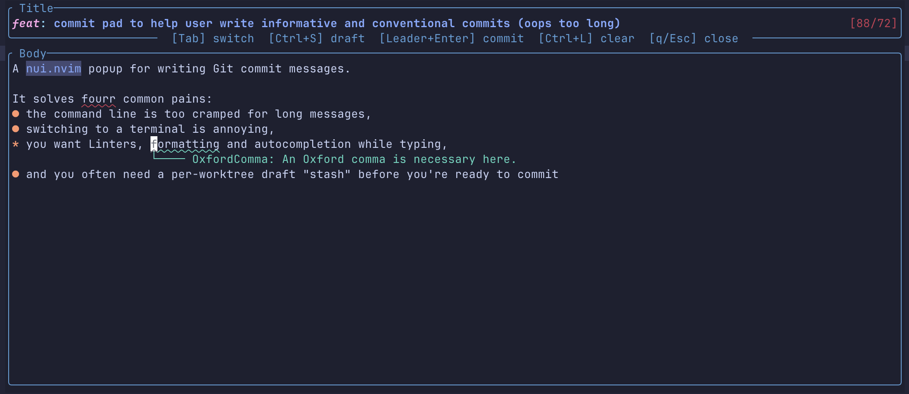

# CommitPad



A lightweight popup for writing Git commit messages directly within Neovim.

It facilitates a descriptive commit style (e.g. [Mitchell Hashimoto](https://x.com/mitchellh/status/1867314498723594247)) by providing a dedicated writing environment.

> **Note:** CommitPad follows Unix philosophy and focuses on the best commit experience, not a full Git toolkit.

## Features

* Markdown Buffer: The input is a `filetype=markdown` buffer, enabling your formatters, linters, snippets, and LSP.
* Persistent & Isolated Drafts: Stored in `.git/commitpad/draft.md`.
    * No `.gitmessage` clutter or `.gitignore` pollution.
    * Drafts are isolated per worktree and persist across sessions.
* Visual Validation:
    * Real-time highlighting of title length to assist with 50/72 rule.
    * Flags non-conventional commit types (e.g., `doc:` vs `docs:`) and structural breaks in the `type[scope][!]: description` format.
* Streamlined Workflow:
    * Non-blocking, async UI for zero friction.
    * Seamlessly move between panes with `hjkl` as if borders don't exist.
    * Instantly edit the previous commit via `:CommitPadAmend`.
    * Automatically carry over tags (e.g., `Signed-off-by`) between commits.

## Why CommitPad?

* Vs `fugitive`: Preserves your window layout by using a floating overlay instead of disruptive splits.
* Vs `$EDITOR`: Instantly summon and dismiss your draft with a dedicated toggle (`<leader>gc`).
* Vs `lazygit`: Leverages your full Neovim setup (LSP, spell check), avoiding the overhead of a TUI context switch.
* Vs `git commit -m`: Enables iterative drafting and multiline formatting, rather than hasty one-liners.

## Installation 

**Lazy.nvim**

```lua
{
  "Sengoku11/commitpad.nvim",
  dependencies = { "MunifTanjim/nui.nvim" },
  cmd = { "CommitPad" },
  keys = {
    { "<leader>gc", "<cmd>CommitPad<cr>", desc = "CommitPad" },
    { "<leader>gac", "<cmd>CommitPadAmend<cr>", desc = "CommitPadAmend" },
  },
  opts = {
    -- Defaults
    footer = false, -- A dedicated buffer that provides a "sticky" area for repetitive tags
    stage_files = true, -- Display staged files in UI
    hints = {
      controls = true, -- Display control hints in the popup border
    },
  },
}
```

## Requirements

- Neovim **0.10+** (uses `vim.system`)
- [`MunifTanjim/nui.nvim`](https://github.com/MunifTanjim/nui.nvim)

## Recommended Configuration

For the best experience writing prose in the popup, these settings are recommended.

### Neovim Options

```lua
-- Soft wrap lines at word boundaries, preserving indentation
vim.opt.wrap = true -- Enable soft wrap (required for the options below)
vim.opt.breakindent = true -- Visual indentation matches the code level
vim.opt.linebreak = true -- Wrap at words, not arbitrary characters

-- Builtin spell check
vim.opt.spell = true
vim.opt.spelllang = { "en_us" }
vim.opt.spelloptions = "camel"
```

### Suggested Plugins

* Grammar: [Harper-ls](https://writewithharper.com/docs/integrations/neovim)
* Rendering: [MeanderingProgrammer/render-markdown.nvim](https://github.com/MeanderingProgrammer/render-markdown.nvim)
